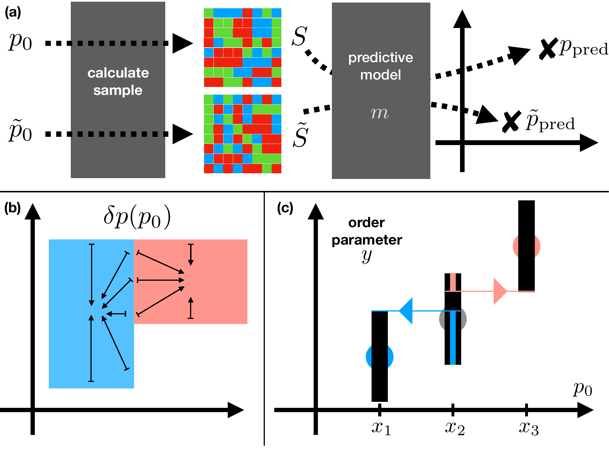

# Vector-field-divergence-of-predictive-model-output-as-indication-of-phase-transitions

---

## Abstract

We introduce a new method to identify phase boundaries in physical systems. It is based on training a predictive model such as a neural network to infer a physical system's parameters from its state. The deviation of the inferred parameters from the underlying correct parameters will be most susceptible and diverge maximally in the vicinity of phase boundaries. Therefore, peaks in the divergence of the model's predictions are used as indication of phase transitions. Our method is applicable for phase diagrams of arbitrary parameter dimension and without prior information about the phases. Application to both the two-dimensional Ising model and the dissipative Kuramoto-Hopf model show promising results. 




## How to run

We have tested our code with Python 3.6.5 and PyTorch 1.0.1. 
Instructions to run:

- install [PyTorch](https://pytorch.org/), Numpy, jupyter-notebook and Matplotlib 
- run the jupyter-notebook

## This repository 

- [x] .. contains a minimal working example for the method introduced in the [paper](https://arxiv.org/abs/1812.00895). We provide data for the Hopf-Kuramoto model with 30 scan points and 10 samples per scan point. The code features:
    - the construction of one training and one test set.
    - initialization of the model (convolutional neural network).
    - training and evaluation on the model.
    - plots of the difference $`\delta p`$  and the divergence $`\nabla \cdot \delta p`$ 
    - visualization of a few samples
- [ ] It does *not* contain the averaging procedure over several independent runs on independent test sets to compute error bars.


If you found this work useful, please cite our [paper](https://arxiv.org/abs/1812.00895).

## Authors:

- [Frank Schäfer](https://github.com/frankschae)
- [Niels Lörch](https://github.com/nloerch)


```
@article{schaefer_loerch_2018,
  title={Vector field divergence of predictive model output as indication of phase transitions},
  author={Frank Sch\"{a}fer and Niels L\"{o}rch }, 
  journal={arXiv preprint arXiv:1812.00895},
  year={2018}
}
```
